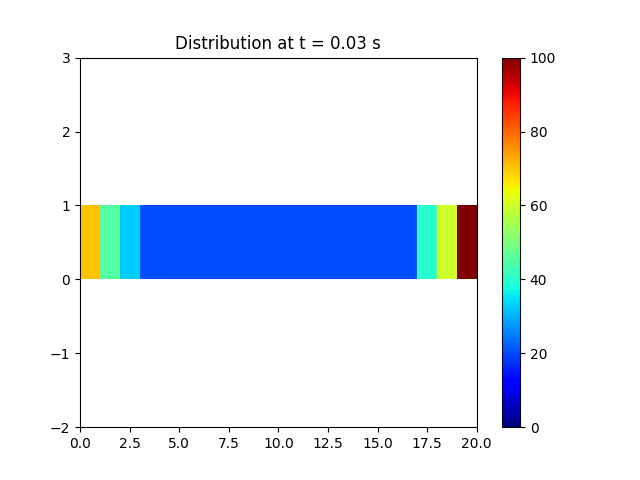

# 1D Conduction Simulation

# 🔥 1D Heat Conduction Simulation

## 1. Overview

This repository contains a Python-based simulation of **1D transient heat conduction** in a rod using the **finite difference method (FDM)**. The simulation numerically solves the heat equation and visualizes the evolving temperature profile as an animated GIF. It’s a great starting point for understanding heat transfer, numerical stability, and visualizing time-dependent physical processes.

<p align="center">
  
</p>

---

## 2. Physical and Numerical Background

This simulation is governed by the **1D heat equation**:

\[
\frac{\partial T}{\partial t} = \alpha \frac{\partial^2 T}{\partial x^2}
\]

Where:
- \( T \) = Temperature (°C)
- \( t \) = Time (s)
- \( x \) = Position along the rod (mm)
- \( \alpha \) = Thermal diffusivity (mm²/s)

We solve this using an **explicit finite difference scheme**:

\[
T_i^{n+1} = T_i^n + \alpha \frac{\Delta t}{\Delta x^2} (T_{i+1}^n - 2T_i^n + T_{i-1}^n)
\]

### Stability Condition

To ensure numerical stability for the explicit method, we use:

\[
\Delta t \leq \frac{1}{2} \cdot \frac{\Delta x^2}{\alpha}
\]

---

## 3. Features

- ✅ Explicit finite difference solver for the heat equation  
- 📈 Temperature profile animated over time  
- ⚙️ Customizable material and simulation parameters  
- 🧊 Dirichlet boundary conditions (fixed temperatures at both ends)  
- 🖼️ Animation saved as `.gif` using `matplotlib.animation`

---

## 4. Simulation Setup

### 🔧 Physical Parameters
- **Rod Length**: 50 mm  
- **Number of Nodes**: 20  
- **Thermal Diffusivity**: 210 mm²/s  
- **Boundary Temperatures**:  
  - Left end: 70 °C  
  - Right end: 100 °C  
- **Initial Internal Temperature**: 20 °C  

### 📐 Numerical Parameters
- Time step `dt` is calculated for stability  
- Animation interval: 50 ms between frames  
- Simulation duration: 4 seconds (can be increased)

---

## 5. Code Structure

- `heat_conduction_simulation.py` – Main simulation script  
- `temperature_distribution.gif` – Output animation showing heat flow

---

## 6. How to Run

```bash
# Install required libraries
pip install numpy matplotlib

# Run the script
python heat_conduction_simulation.py

