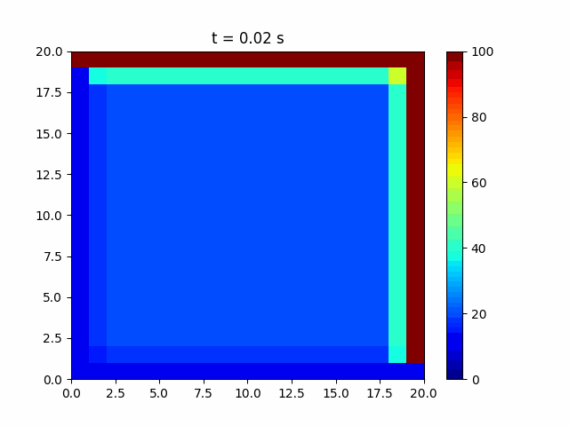

#  2D Heat Conduction Simulation

## 1. Overview

This repository contains a Python-based simulation of **2D transient heat conduction** in a square plate using the **finite difference method (FDM)**. The simulation numerically solves the 2D heat equation and visualizes the evolving temperature field as an animated GIF.

  

---

## 2. Physical and Numerical Background

This simulation is governed by the **2D heat equation**:

\[
\frac{\partial T}{\partial t} = \alpha \left( \frac{\partial^2 T}{\partial x^2} + \frac{\partial^2 T}{\partial y^2} \right)
\]

Where:
- \( T \) = Temperature (°C)  
- \( t \) = Time (s)  
- \( x, y \) = Spatial dimensions (mm)  
- \( \alpha \) = Thermal diffusivity (mm²/s)  

We solve this using an **explicit finite difference method** with time-marching updates at each node on a 2D grid.

### Stability Condition

To maintain numerical stability:

\[
\Delta t \leq \frac{1}{4} \cdot \min\left(\frac{\Delta x^2}{\alpha}, \frac{\Delta y^2}{\alpha} \right)
\]

---

##3. Features

2D heat conduction simulation on a square plate  
Fully animated temperature field over time  
Dirichlet boundary conditions (fixed temperatures on all edges)  
Customizable mesh resolution and physical parameters  
Animation saved as `.gif` using frame-by-frame stitching with PIL  

---

## 4. Simulation Setup
