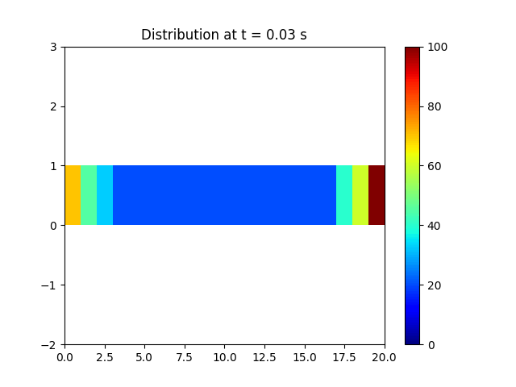
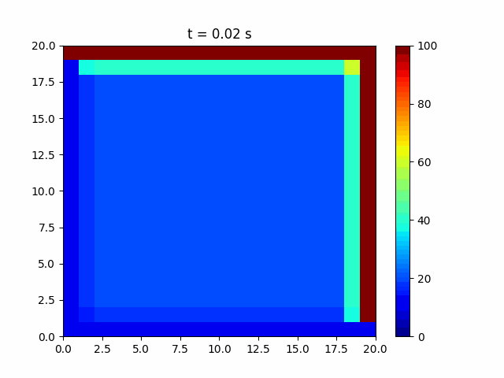

# 🔥 Heat Conduction Simulation in 1D and 2D

## 🧪 Project Overview

This project numerically models **heat conduction** in both **1D rods** and **2D square plates** using the **finite difference method (FDM)**. The simulations are implemented in Python and visually animated to demonstrate how temperature evolves over time within a domain under specific boundary conditions.

<p align="center">
  
  
  <br/>
  <em>1D Heat Conduction (left) | 2D Heat Conduction (right)</em>
</p>

---

## 📂 Repository Structure


---

## ⚙️ Numerical Method

Both simulations solve the **heat equation** using an **explicit finite difference scheme**:

- **1D Heat Equation**  
  \[
  \frac{\partial T}{\partial t} = \alpha \frac{\partial^2 T}{\partial x^2}
  \]

- **2D Heat Equation**  
  \[
  \frac{\partial T}{\partial t} = \alpha \left( \frac{\partial^2 T}{\partial x^2} + \frac{\partial^2 T}{\partial y^2} \right)
  \]

- Stability condition for both is enforced via:
  \[
  \Delta t \leq \frac{1}{2} \cdot \frac{\Delta x^2}{\alpha} \quad \text{(1D)}
  \]
  \[
  \Delta t \leq \frac{1}{4} \cdot \min\left(\frac{\Delta x^2}{\alpha}, \frac{\Delta y^2}{\alpha} \right) \quad \text{(2D)}
  \]

---

## 🔍 Explore Simulations

### 🔹 [1D Heat Conduction](./1D-Conduction/)
- Rod length: 50 mm  
- 20 grid points  
- Fixed temperatures: 70 °C (left), 100 °C (right)  
- Initial interior: 20 °C  
- Animation shows temperature distribution across the rod

### 🔹 [2D Heat Conduction](./2D-Conduction/)
- Plate size: 50 × 50 mm  
- 20 × 20 grid  
- Fixed boundary temperatures: 10 °C and 100 °C  
- Animation shows temperature diffusion on the 2D plate over time

---

## ▶️ How to Run

### Prerequisites
```bash
pip install numpy matplotlib pillow


cd 1D-Conduction
python 1_D-Heat\ conduction.py

cd ../2D-Conduction
python 2-D_HeatConduction.py
